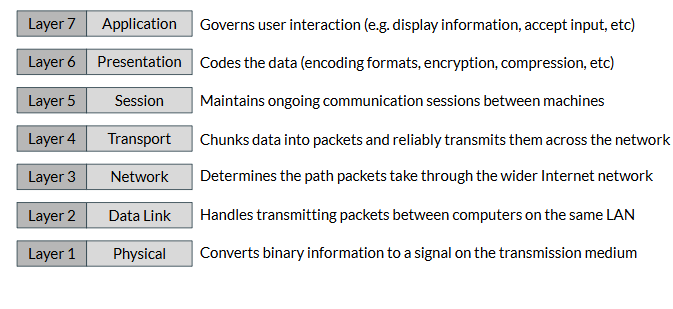
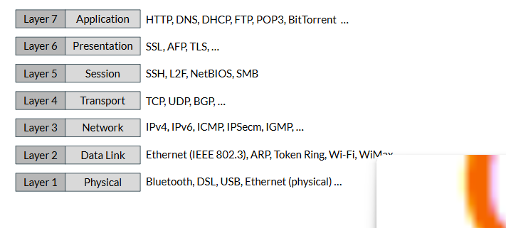
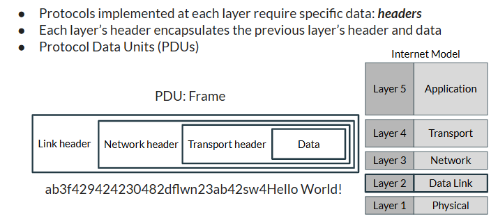
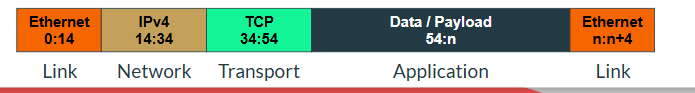
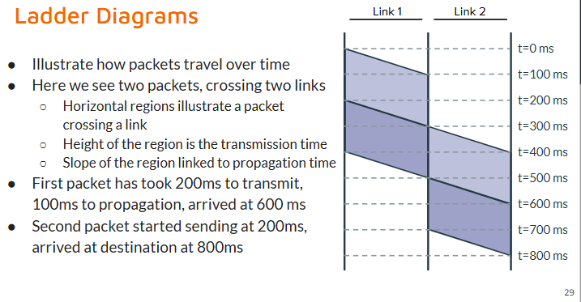

# WHAT IS THE INTERNET

> Network of interconnected networks implemented using TCP/IP protocol stack
> TCP/IP also called Internet Protocol Suite

## Architecture of the Internet
1. Software Architecture
2. Physical
3. Organizational Archticture

## Software Architecture
- Layered Protocols
- Protocol Data Units & Encapsulation
- End-to-end Principles

### Layered Systems
  - Open SYstem Interconnection (OSI) model created to serve as template for networked systems
    - 7 Layers
      1. Physical
      2. Data Link
      3. Network
      4. Transport
      5. Session
      6. Presentation
      7. Application
    - Each Layer only talks to layer below and above
    - Physical is the "bottom layer"
    - Each layer does own thing
> General Responsibilites
>   
> Protocols
>   

- TCP/IP Model
  - Combines some of the layers of the OSI model
  - Still uses same ideas, just condensed
  - doesnt include presentation or session layer

### Protocol Data Units and Encapsulation

- Protocols implementation requires **headers** at each layer
  - Each layer encapsulates previous layer header and data
  - **Protocol Data Units (PDUs)**
> Looks like this once it reaches Data Link Layer 
>  

### End-To-End Principle
- Core network philosphy
  - Keep **CORE** network simple
    - general services, minimal feature
  - Intelligence at the edges

### Physical Architecture
1. Hosts
2. Communication Links
3. Infrastructure
- Lil anology
  - **Hosts and end systems** are the places people care bout going to
  - Schools, post office, etc
  - ***Communication Links** are the roads people drive on
  - Routers and switches are the **infrastructure** controlling the flow of traffic
    - Traffic lights and shi
  - The Data moving through the internet is the cars
## Hosts and End Systems
- This is where data and applications **LIVE**
  - Everything person cares about is on a host/end system
- Hosts live on the **EDGE** of internet
- Hosts need to be connected to internet via Network Interface Controller (NIC)
  - NIC = WIFI CARD
  - Allows host into communication links that connects all internet together
## Communication Links
- Many types
  - Ethernet
  - Coaxial
  - FIber 
  - WIFI
- Each has different advantage
- **Twist-Pair Copper Wire**
  - Basic ethernet (used in Cat5+ cables)
  - Very cheap
  - Two copper wires twisted around eachother
  - Data speeds range from 10 mbps to 10gbps
  - Data transmitted by modulating voltage on cable
- **Coaxical Cable**
  - Two copper wires, one inside the other
  - Better performance then twist-pair
  - Mainly replaced by Cat5+ cables (etherent)
- **Fiber Optics**
  - Glass fibers carries light pulse
  - Stupid fast, 10gbps to 10+ tbps
  - Very low error rate
  - EXPENSIVE ASF
- **Radio**
  - WIFI essentially
  - Unguided medium carried by electromagnetic spectrum
  - Issues with this
    - speeds affected by radio frequency used
    - prone to issues compared to others
## Infrastructure
- Routers, Switches, and APs control the flow of data 
  - **Routers**
    - connect multiple networks together and facilate data transfers btwn them
  - **Switches**
    - connect multiple wired devices and facilates communcation btwn them
  - **APs**
    - Access Points
    - WIFI Shit
- Other Important Devices (not as important)
  - Modem: Converts digital data into analog signal
  - Hubs: OLD, like switches, less robust
  - Wireless repeaters: Wifi extenders
  - Network Bridges: Connects multiple network segments together the way switches connect devices
- **Link Interfaces**
  - Routers and switches contain # of interfaces where Cat5+ can be connected
  - Routers take data in one interface and push it out in another
  - Wireless devices limited to number of simultaneous connections, not physical based on specturm availability
### Organizational Architecture
1. Edge vs Core
2. Hierachical 
3. Societal vs Technical

## Edge vs Core
- Loose groups of hosts and infrastructure
  - what normal people use/encounter
- Core is managed by ISPs
- Host always lives on **EDGE**
- Edge Routers connect hosts **into the core system**
## Hiearchical Organization
- Internet is a network of networks of networks of networks ... 
- We can loosely divide edge and core
  - Edge is LAN (Local Area Network)
  - Edge where data and applications live
  - Edge routers connect LAN into core of internet through ISPs

# DATA TRANSMISSION
- Terminology
  - Packets refered to as differently depending on which layer
    - Frame: Link Layer (layer 2)
    - Packet: used whn focues on Network Layer (layer 3)
    - Datagram: UDP Protocol at Transport Layer (layer 4)
    - Segment: TCP Protocol at Transport Layer (layer 4)
    - Message: Application Layer (layer 5)
  - Packet used most often

## Packets 
- Data from application layer divided into packets by transport layer
- Each layer adds own headers to packet of data
- Size of allowed data is restricted
  - Max size for ethernet frame is 1518 btres
  - Max Transmission Unit is 1500 bytes
  - Max Segment Size when using TCP is 1460
> 

## Sharing the Internet
- Internet must share its rescourses simultaneously
- Two main options to do this
- 1. Frequency Domain Multiplexing
- 2. Time Domain Multiplexing

### Frequency Domain Multiplexing
- DSL (Digitial Subscriber Line)
  - Each home has own network line
  - Support simultaneous download, upload, etc
  - Different Frequency bands used for each thing
    - Download: 50 khz to 1MHz band
    - Upload: 4Khz to 50Khz
### Time Domain Multiplexing
- Family sharing one computer
  - Mom makes schedule when people can use computer
  - schedule tailored to family

## Back to Packets
- Breaking data into packets makes it efficently support dynamic time multiplexing
- Many computers **need** to share transmission lines
- Inneficient to make scheudle 
  - Instead packets streamed out as they are received in
  - Automatic dynamic time multiplexing

## Network Topology
- how a network is structured
- loops very bad if mishandled
- Want our network to have a tree structure, but we need hardware loops in mediums for most large networks

# PART 2

# QUANTIFYING NETWORK PERFORMANCE

## Sources of Latency
  
### What Causes Latency
- Delay btwn data sent and received
- Four sources of latency in the network
- 1. **Transmission/Bandwith delay**
- 2. **Propagation Delay**
- 3. **Processing Delay**
- 4. **Queuing Delay**
- Total latency equals = 
- > total = trnasmission + propagation + processing + queueing

## Sources of Delay
- **Transmission Delay**
  - time required to transmit packet onto the wire
  - Packets measured in bytes
  - Transmission rate in bits / second
  - >  transmission = packet length / transmission rate of link = L / R
- **Propagation Delay**
  - time needed for data to travel along the "wire" to destination
  - Data moves at dif speeds on dif mediums (fiber, ethernet, WIFI)
  - > prop = distance / data speed on "wire" = dist / s
- **Processing Delay**
  - Time for receving device to read and process packet
  - Typically microsecond, i.e. we dont rlly worry about this
  - Delay comes from checking bi-lvl error
  - No formula b/c yeah
- **Queuing Delay**
  - Store and Forward
    - router must wait until its recived whole packet before it can start forwarding
    - Doesnt know where to send until full packet has arrived
    - B/c of this, router need a buffer to store packets before forwarding
  - Queuing delay is time packet spends waiting to be transmitted b/c outgoing link is busy
    - i.e. router busy so have to wait to send data, sits in buffer
  - queue = variable and depends on network traffic, ranges from 0 to infinity
  - Gets very long as the value of queuing delay approaches one
  - near 0 is small delay 
  - **anthing >= 1 is it approaching infinity**
    - B/c it grows faster then it can send shit out

## Calculating Latency
- Need to study this shit
- just add up the 4 delays
- Can also use ladder diagrams (IDK How to rlly)
> 

## Throughput
- **Bandwidth**: amount of data that **CAN** be transmitted per second
- **Throughput**: Amount of data that **IS** transmitted per second
- **Goodput**: Amount of **USEFULL** data transmitted per second
- ***Bottlenecks***: Constrains throughput on a network so many people can use it

## Errors
- Multiple Sources
- 1. Corrupted Pakcets
- 2. Dropped Packets
- 3. Misordered Packets
- 4. Collisions

### Corrupted Packets
- Sometimes packed get corrupted mid flight
- If they do, usually not possible to tell what flipped, so  packet is **THROWN AWAY**

### Dropped Packets
- Router have a finite capacity
- If packet arrives, but no space, it is dropped, i.e. lost
- May be retransmitted from previous node, or orgin, or not at all
- Corrupted packets also get dropped, but not b/c overflow

### Misorderd Packets
- Applications want **DATA** NOT **PACKETS**
- NEtwork systems break data into packets for effiecny
- Packets need to be received in the exact same order they were sent
- If not, data can't be reconstructed so it is **DROPPED**

### Collisions
- Occurs when two or more hosts attempt to transmit on the same media at same time
  - Ex: Two homes sharing one coaxial cable. Would be collision if the two home tried to interact with the ISP at same time
- Collisions are **IMPOSSIBLE** on non-shared media, i.e. j**ETHERNET CABLES**
