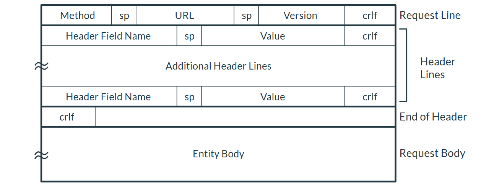
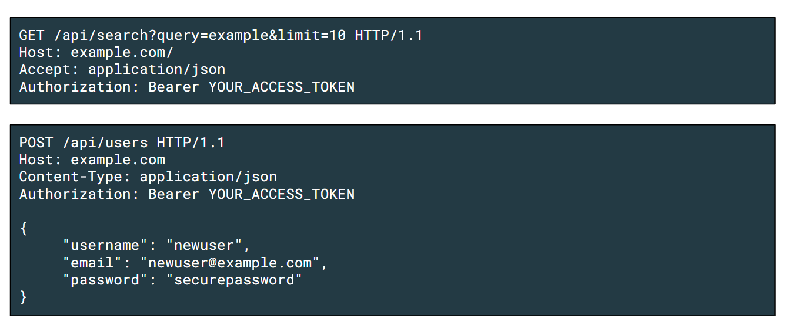
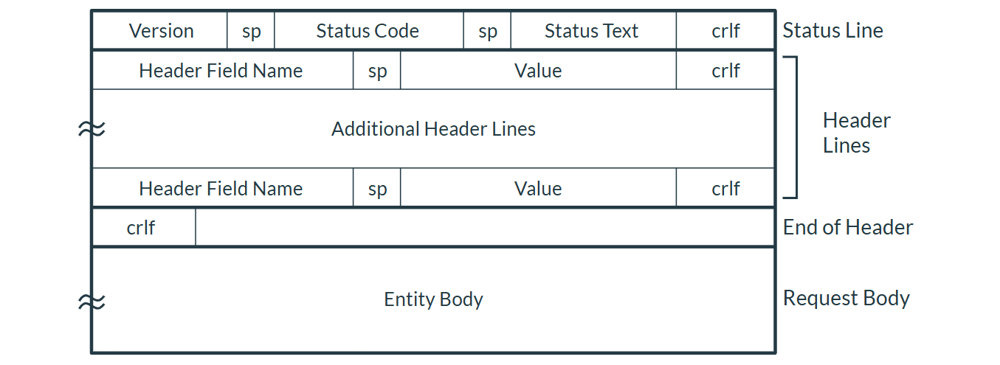
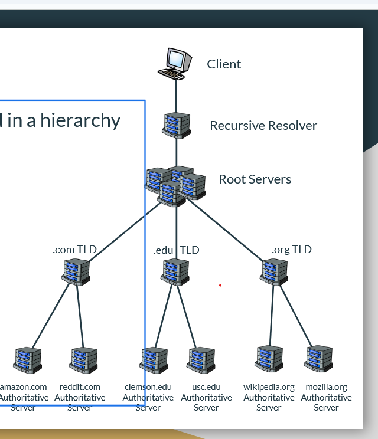
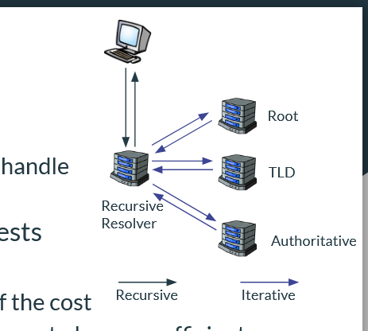
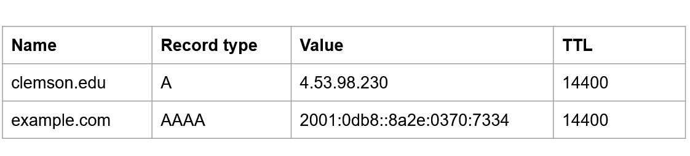
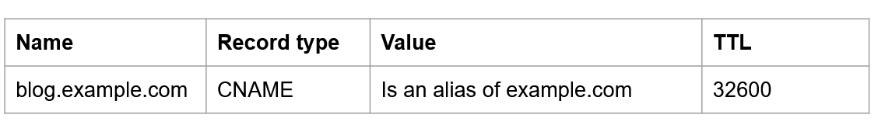
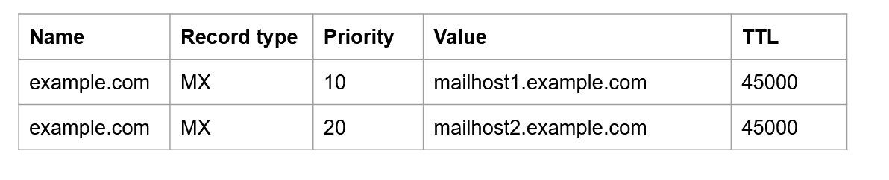
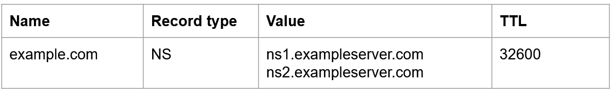
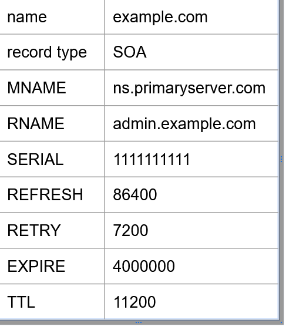

# Hypertext Transfer Protocol: HTTP

## Network Application Architectures
- Two Main Systems
  - 1. **Clien-server Model**
  - 2. **Peer-to-Peer Model**
- Both operate and live on the **EDGE**
- ### Client-Server Model
  - Clients request info from server
  - Server provides info to client
  - Clients DONT talk to eachother
  - DISTINCT ROLES
    - Client **consume** data, server **provides**
  - #### Servers
    - Must always be avilable for applications to properly work
    - Usually fixed IP
    - Can run essentially on any hardware if there are not many clients
  - #### Clients
    - Only on when usrr needs them
    - IP doesnt matter b/c they talk to server first
    - Dont need to be as powerful as server
    - Client-Server Communication
      - Follows request-response messaging pattern
      - client submits reuqest in agreed on format
      - Server process and returns data in proper format
- ### Peer-to-Peer (P2P) Model
  - No central server
  - Focusus on comms btwn peers 
  - Benefits
    - self-scalable
    - Cost-effective
  - Challenges
    - Security and privacy more complicated
    - requires more sophistaced models and protocols
    - potential issue with performance and reliability

## The Web and HTTP 
- World Wide Web is one of many applications that run on the internet
- Web's application protocol is HTTP / HTTPS
- Web browsers (clients) exchange HTTP messages with servers to get web page shit
- ### Anatomy of Web Page
  - Web page consist of a lot of objects/files
  - All files referenced using URLs
  - Base HTML files include references to all files needed for page
- ### HTTP Protocol
  - Defines how clients communicate with server to request content
  - General Process
    - 1. Client opens TCP connection to server on port 80 (HTTP) or 443 (HTTPS)
    - 2. Server accepts
    - 3. CLient sends HTTP request and receives HTTP response
    - 4. connection closed
- ### HTTP Request Message
  - > Format for HTTP Message
    - >   
- ### Common Request Message Method Types
  - **GET**: Most common, requests content, no body
  - **POST**: Requests content and sends data in message body
  - **HEAD**: Like GET, but only retreives HEADER,
  - **PUT**: Uploads file to specific location on server, file included in message body
  - **DELETE**: Delete specific resource on server
  - > EXAMPLE OF HTTP REQUEST MESSAGE
    - > 
- ### Common HTTP Request Headers
  - Many different headers possible, but are optional
  - Some common ones include
    - Host: addy of server
    - User-Agent: web browser that generated request
    - Accept: Media types by client
    - etc LOOK AT SLIDE 18 if u want em all
- ### HTTP Response Message
  - similar to request
  - > 
  - #### Common HTTP Response Satus Codes
    - 200 OK: Request success, requested content in message body
    - 301 Moved Perm: Request obj has moved, ,new url included in location header
    - 400 Bad Request: Server could not understand, syntax error from client
    - 404 Not Found: requested rescourse not found
    - 500 Internal Server error: some bad happend on server side
  - #### Common HTTP Response Headers
    - Date: Timestamp when response was made
    - Server: Info about web server software
    - Last-Modified: Last modified time stamp
    - etc

## Cookies
- HTTP is a **STATELESS PROTOCOL**
  - each request independent of prior ones
  - Server does not rmbr prior requests
- Cookies are a way to maintain state across requests
  - Track user behavior
  - Keep users  logged in
  - Rmbr preferences
- ### 4 Components to Cookies
  - 1. Set-Cookie header in an HTTP response message
  - 2. Cookie heaer in an HTTP request message
  - 3. Cookie storage on users device, managed by browerser
  - 4. Server-side storage linking cookie values to data
- ### Types of Cookies
  - **Sessions Cookies**
    - temporary, deleted when browser closed
    - often used to keep u logged in
  - **Persistent Cookies**
    - Persist across sessions, expire after set amt of time (days to years)
    - Useful for
      - Remaining logged in across sessions
      - Tracking
      - Personilzation
- ### Extra Details
  - Cookies received from **server** can contain several attributes
    - name-val pair
    - Experation date
    - Domain attrivute
    - etc
  - Cookies in a **REQUEST** from the **CLIENT JUST INCLUDE NAME-VAL PAIR** 
  - Limitations
    - Cookies limuited to 4kB in size
    - Browser limit number of cookies allowed in domain
    - Users can delete and block cookies
  - ### Security Implications
    - Cross-Site Scrupting (XSS) Attcaks
      - javascript cookies designed to steal info, can be on ads and shit
    - Cross-Site Request Forgery (CSRF) Attacks
      - when malicious site tricks a users browser into making not wanted requests to another site where user is authenticated
      - Using info from one site to steal shit from another
    - Lead to privacy concers 
      - THird party cookies on websites
      - However many people block these now

## Web Caching
- Stores previously requested data closer to end users
- goal is to make a request without contacting orgin server
- Benefits
  - Reduces response time for clients
  - Reduces load on orgin server
- Web caches operate as client and server application
- Caches can be local to the user or manged by ISP or institution
- ### Web Caching Process
  - 1. User requests object from website
  - 2. Reuqest is routed to a cache proxy server
  - 3. The cache proxy server tries to serve the requested object
    - a. If obj is cached, it returns it to client
    - b. Otherwise, request the object from remote ORGIN SERVER, cache it, reuturn to client

- ### Conditional  Get 
  - Cache validation mechanism to avoid stale content
    - Stale means outdated
  - Client sends the get request if files are suspect to be stale
  - Server checks to see if outdated

- ### Modern HTTP Features
  - 1. HTTP/2
        - Multiplexing and prioritization requests to allow a site to request multiple things at same time
        - uses binary protocol instead of plain text
  - 2. HTTP/3
        - biggest changes is migrating transport layer protocol: QUIC instead of TCP
        - allows user to change network without reestablishing network connection
  - 3. Websockets
      - Websockets provide full-duplex, bidirectional communication channel over single TCP connection
      - This better then HTTP request-response model b/b makes applications difficult to implement
      - eventually websockets wont need HTTP headers

# DOMAIN NAME SYSTEMS (DNS)

## What Problems DNS fixes
  - DNS essentially allows people to type a URL but really it connects them to an IP
  - Instead of typing 13.44.211.1 people can type clemson.edu, but machine reads IP
  - decouples mapping btwn hostnames and IP's
    - mappings btwn them can change, IPs change
    - DNS servers update mapping btwn both so they can change and work fine still
  - ### Hostname / Domain Names
    - Domain names structured hierarchically 
    - > 
    - TLD's
      - top lvl
        - .com, .org. net
      - Country code
        - .us, .fr
    - Secondary domain is website name
    - Sub domain allow for further organization
    - path specifiers location of resourse on server

## DNS Network Organization
  - ### Distributed Databases
    - DNS records hosted on bunch of databases on DNS servers across world
    - Being distributed good for mass clients and handling lots of traffic
  - ### Hiearchical DNS Servers
    - 4 Class ordered in hierachy
      - 1. Recursive Resolver Server
      - 2. Root Servers
      - 3. Top-Level Domain Sever (TLD)
      - 4. Authoritative DNS Severs
    - > 
  - ### Recursive Resolver Server
    - Run by ISP, public use
    - Act as proxys and caches to speed up requests
    - These dont store any DNS records
  - ### Root Servers
    - Live at top of hierarchy database
      - 13 logic servers, each a network of servers
      - queries to root sent to closest to physical server
    - Root servers provide info about how to contact the right TLD server for given request
  - ### Top-Level Domain Server
    - Dif companies manage one or more TLDs
      - ex: Verisign manages .com and Educause manages .edu, .etc
    - Keep track ofg what authoritative DNS server manage records for specific domain in TLD
  - ### Authoritative DNS Server
    - Where records for domain held
    - large companies usually run their own
      - can also purchase from other company
    - Always cdloned
      - primary server where records are stored
      - secondary server keeps track when primary changes
  - ### DNS Caching
    - Recursive resolvers usually cache DNS records they fetch
      - makes requests to be solved faster
    - Stale entries can cause problems
    - DNS cache posiosiony is security concern
  - ### Recursive Resolution
    - Requests sent to DNS server are recursive
    - then sends iterative requests to root, TLD, and authoritative
    - > 
- ## DNS Protocol
  - ### The DNS Protocol
    - DNS runs over UDP and uses port 53
    - Built around DNS resource records
      - Records have 4 fields: Name, Type, Data, TTL
    - multiple type values: A, AAAA, CNAME, MX, NS, PTR, SOA, TXT
    - #### A and AAAA Rescourse Record
      - A: Maps domain name to IPv4
      - AAAA: Maps domain name to IPv6
      - Used for basic domain name to IP address mapping
      - > 
    - ##### CNAME (Canonical Name) Rescourse Record
      - Maps an alies domain name to canonical domanin name
        - used to prefix urls with www
        - enables subdomain
      - entry point to same IP as root, however web server can return dif info when asked
      - > 
    - #### MX (Mail exchange) Rescourse Record
      - specifies mail server in charge of accepting email for domain
      - enables delegation of email handling to specific servers
      - 
    - #### NS (Nameserver) Rescourse Record
      - specifies authortiative namerservs for domain
      - used for delegating DNS reslution to other namersvers
      - Critical for hioerachical and districutbed natuire of DNS
      - > 
    - #### PTR (Pointer) Resource Record
      - Maps IP to domain name
      - Help identify domain name associated with IP addy
    - #### SOA (Start of Authority) Resource Record
      - Specifies authoritative info about DNS
      - Zones specify are of control over namespace
      - > 
    - #### TXT (Text) Resource Record
      - Allows arbitrary text data with domain name
      - used for human readingt and email spam prevenmtion
  
  - ### DNS Message Format
    - Not readable
    - 12 byte header
    - Variable # of questions included
  - ### DNS Message Header
    - identification to map queries to replies
    - buncvh of flags
    - number of questions, answers, authority, and other sutff included
  - ### DNS Question Section
    - Resourcse names listed as chain of lables
      - each label is preceded by a byte indicating its length
      - 0 byte = final label
  - ### DNS Resource Records 
    - Final three sections contain dif types of resource records
    - Each includes 
      - Names defined as before with byte
      - RDATA can store datra according to specific format
  - ### DNS Resource Records
    - Contents of RDATA depend on type of resource record
  - ### Inserting RR's into DNS Database
    - register name which is then registerd to DNS database
    - U provide registrar with primary and secondary authrotiativer DNS serrvers (provided by hosting service)
      - Type NS and A records then added to appropriate TLD servers
- ## DNS Security Challenges
  - Many potential attakcs
    - cache posion
    - DNS hijacking
    - amp attacks
    - tunneling
  - ### Cache Poisoning
    - making false DNS records into a cache
      - causes resolver to return malicious website
    - attacker sends bunch of forged responses to recursive resolver
    - one can be accepted
  - ### DNS Hijacking
    - Redirects DNS rqueires to dif server than intended
      - edge routers configured to point to malicious RR
      - Authoritiative DNS server can be compromised and contain maliocious records
  - ### DNS Amplification Attacks
    - DDos attack
      - Someone sends bunch of DNS query to public DNS server spoofing the source IP with victims address
      - Query is crafggtyed to generate lots of responses
      - DNS returns these many responses 
      - Repeated a lot to overload victims server
  - ### DNS Tunneling
    - packages data from other prtocols or progrtams as queries or responses, allowing it to bypass firewall and security stuff
    - have to install mnalware on target machine 

# BITTORRENT

- ## BitTorent Basics
  - ### History
    - made in 2001
    - popular for downloading big ahh files
  - ### Foundational Concepts
    - Client: application using BitTorrent
    - Peers: individual computers or devices in participating network
    - Trackers: Servers to track which peers have what part of files
    - Torrent Files: file with the metadata needed to start the download
    - Seeders: Peers with copy of file who are only sharing it
    - Leechers: ppeers in proccess of downloading file
    - Swarms: All peeers involved with particular torrent
  - ### Structure of Torrent FIle
    - Contain several elements
      - announce URL
      - Info dictionary 
        - Name
        - Piece Length: number bytes in each piece
        - Piece: string contrainibgn the SHA1 hashes of all pieces put together
        - Files: List all files, paths and sizes
      - Info Hash: 160 bit SHA1 hash of info dictionary
    - ### Process
      - Client connects to the tracker using HTTP GET
      - Tracker responds with list of peers in swarm 
      - Client establishes TCP connections with these peers and begins requesting pieces of file
    - ### Rewarding Cooperation
      - Swarm rewards cooperation and punishes selfish behavior
        - peers upload to peers that provide best download rate
      - Optimistic unchoking: system automatically randomly unchockes peers regalredss of rate
        - potential better peers
      - anti snubbing
        - if client, doesnt receive data in 60 seconds, considers it snubbed by peer
  - ## Distributed Hash Tables (DHTs) and Other Improvements
    -  ### DHTs
       -  used to rid of need for trackers by providing lookup similar to hashtables
          -  decentralized
          -  good for scalability
          -  fault tolerant: will function when nodes join or leave
   - ### DHT Remote Procedure x Calls (RPC)
     - BitTorrent DHT uses 4 RPCs
       - PING: probes to see if node alive
       - FIND_NODE: Returns the k nodes closest to ID
       - GET_PEERS: return peer info for info_hash
       - ANNOUNCE_PEER: announce that peer is downloading torrent
     - RPC Messages have 4 values
       - Transaction ID
       - Message type
       - Method name
       - Method arguments
     - RPCs ALWAYS point-to-point\
   - ### Adding Nodes to DHT
     - tries to add to right k-buckety
     - goal is not to track all nodes in system, but to maintain list of active nodes at various distances that can be connected
   - ### Finding Nodes in DHT
     - need to find closest nodes to its ID
     - Check bucket node is in 
       - check surrounding buckets if needed 
     - efficient
     - good scalability
   - ### Announcing Torrent Availbility
     - Sends announce message with 1650 bit info hash
     - Nodes reposnsible for track of peers related with torrent
   - ### Finding Peers
     - when client wants to find peers, looks up 160 bit info ahsh of torrent and finds closest nodes
     - Each nodes can be queried for info about peers
   - ### Bootstrapping in DHT
     - bootstrap nodes respond with list of close nodes whicdh get added to roputing table
     - IDEK tbh anymore
   - ### Network CHUM
     - nodes continously leaving and joinig network
     - high chrun not great
     - k-buckets pprovide some resistance to churn
       - multiple options ready if node goes offline
     - nodes periodically re announce to refresh the network
   - ### Peer Exchange (PEX)
     - second method used to discover peers without trackers
     - when two peers connect they can opt to PEX
     - once a min, each peer sends PEX message containg added and dropped peers
     - PEX often used alongside trackers and or DHT
   - ### Magnet Links
     - UUniform Resourse Indicators (URI) that incl;ude params to identify torrent without being .torrent
 - ## Real World Use Cases
   - Linux downloads
   - Video game downloads
   - Moving large datasets

  